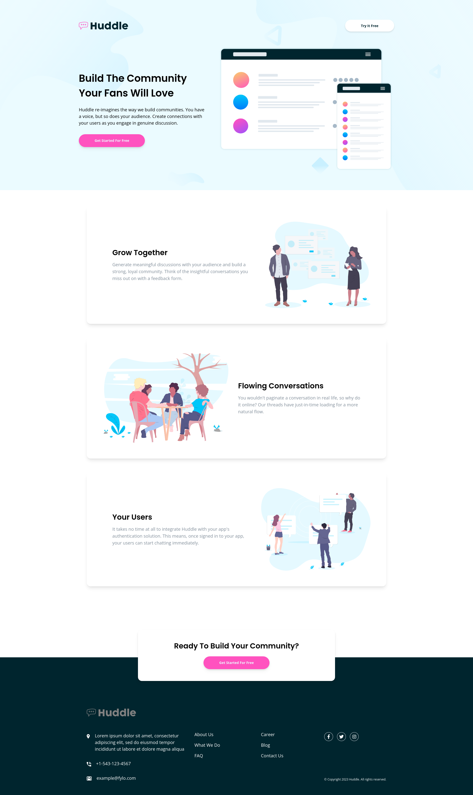

# Frontend Mentor - Huddle landing page with alternating feature blocks solution

This is a solution to the [Huddle landing page with alternating feature blocks challenge on Frontend Mentor](https://www.frontendmentor.io/challenges/huddle-landing-page-with-alternating-feature-blocks-5ca5f5981e82137ec91a5100). Frontend Mentor challenges help you improve your coding skills by building realistic projects.

## Table of contents

- [Frontend Mentor - Huddle landing page with alternating feature blocks solution](#frontend-mentor---huddle-landing-page-with-alternating-feature-blocks-solution)
  - [Table of contents](#table-of-contents)
  - [Overview](#overview)
    - [The challenge](#the-challenge)
    - [Screenshot](#screenshot)
    - [Links](#links)
  - [My process](#my-process)
    - [Built with](#built-with)
  - [Author](#author)

**Note: Delete this note and update the table of contents based on what sections you keep.**

## Overview

### The challenge

Users should be able to:

- View the optimal layout for the site depending on their device's screen size
- See hover states for all interactive elements on the page

### Screenshot

### Links

- Solution URL: [source code](https://github.com/codexshell/huddle-landing-page-with-alternating-feature-blocks)
- Live Site URL: [website](https://huddle-landing-page-with-alternating-feature-blocks-5vt.pages.dev/)

## My process

### Built with

- Semantic HTML5 markup
- CSS custom properties
- Flexbox
- CSS Grid
- Mobile-first workflow
- [tailwindcss](https://tailwindcss.com/) - CSS framework
- [Astro](https://astro.build/) - JS library

## Author

- Website - [Silvanos Eric](https://codexshell.github.io/)
- Frontend Mentor - [@codexshell](https://www.frontendmentor.io/profile/codexshell)
- Twitter - [@codexshell](https://twitter.com/codexshell)
